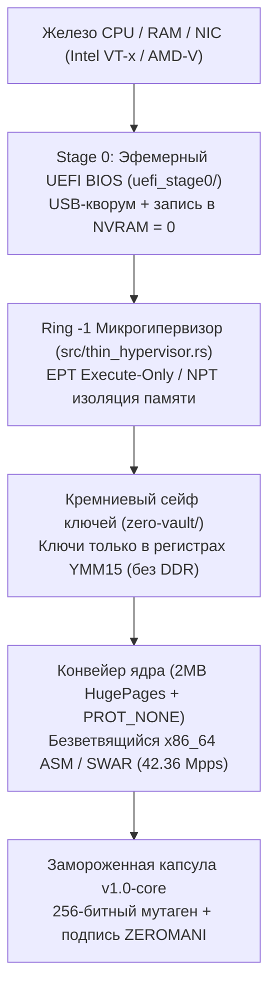
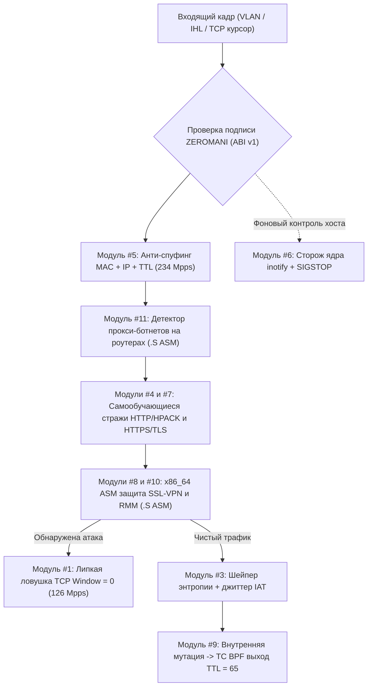

# Вертикальная архитектура ядра и модулей (`v1.0-core`)

## 1. Как устроено ядро (снизу вверх: от железа до капсулы)

```mermaid
flowchart TD
    HW["Железо CPU / RAM / NIC (Intel VT-x / AMD-V)"] --> S0["Stage 0: Эфемерный UEFI BIOS (uefi_stage0/)<br/>USB-кворум + запись в NVRAM = 0"]
    S0 --> HV["Ring -1 Микрогипервизор (src/thin_hypervisor.rs)<br/>EPT Execute-Only / NPT изоляция памяти"]
    HV --> VAULT["Кремниевый сейф ключей (zero-vault/)<br/>Ключи только в регистрах YMM15 (без DDR)"]
    VAULT --> CORE["Конвейер ядра (2MB HugePages + PROT_NONE)<br/>Безветвящийся x86_64 ASM / SWAR (42.36 Mpps)"]
    CORE --> CAPS["Замороженная капсула v1.0-core<br/>256-битный мутаген + подпись ZEROMANI"]
```

## 2. Как работают 11 подключаемых модулей (`modules/`)

```mermaid
flowchart TD
    PKT["Входящий кадр (VLAN / IHL / TCP курсор)"] --> VERIFY{"Проверка подписи ZEROMANI (ABI v1)"}
    VERIFY --> L2["Модуль #5: Анти-спуфинг MAC + IP + TTL (234 Mpps)"]
    L2 --> L4["Модуль #11: Детектор прокси-ботнетов на роутерах (.S ASM)"]
    L4 --> L7A["Модули #4 и #7: Самообучающиеся стражи HTTP/HPACK и HTTPS/TLS"]
    L7A --> L7B["Модули #8 и #10: x86_64 ASM защита SSL-VPN и RMM (.S ASM)"]
    L7B -- "Обнаружена атака" --> TRAP["Модуль #1: Липкая ловушка TCP Window = 0 (126 Mpps)"]
    L7B -- "Чистый трафик" --> SHAPE["Модуль #3: Шейпер энтропии + джиттер IAT"]
    SHAPE --> EGRESS["Модуль #9: Внутренняя мутация -> TC BPF выход TTL = 65"]
    VERIFY -. "Фоновый контроль хоста" .-> WD["Модуль #6: Сторож ядра inotify + SIGSTOP"]
```
